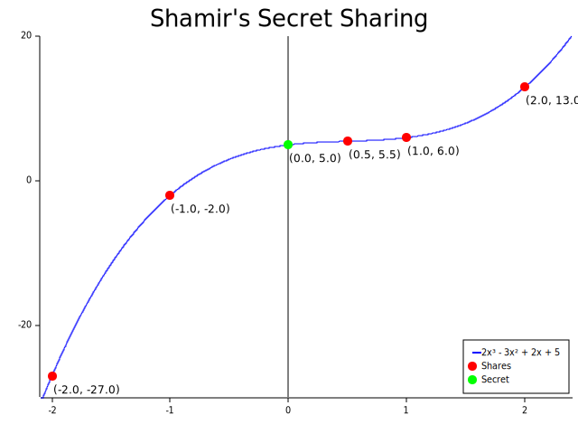

# Shamir's Secret Sharing Image Generator

[](https://opensource.org/licenses/MIT)

> I am the [~~Lizard~~ Polynomial King, I can do anything!](https://youtu.be/ashTaoGrR2o?t=642)
>
> Jim Morrison

This repository contains the Rust crate used to generate the images for the blog post
["Shamir's Secret Sharing"](https://storopoli.io/2024-04-14-shamir-secret-sharing)
on [`storopoli.io`](https://storopoli.io).



## Overview

Shamir's Secret Sharing is a method in cryptography. 
It is a form of secret sharing, where a secret is divided into parts,
giving each participant its own unique part. 
To reconstruct the secret, some or all of these parts are needed.

Under the hood it uses polynomial interpolation to generate the shares.

The code in this repository is used to illustrate this concept visually.

## Usage

To generate the images, run the main script using `cargo`:

```bash
cargo run --release
```

The images will be saved in the `plots` directory.

## Acknowledgements

Under the hood the code uses the [`plotters`](https://lib.rs/crates/plotters) crate to generate the images.


## License

This project is licensed under the MIT License -
see the [LICENSE](LICENSE) file for details.